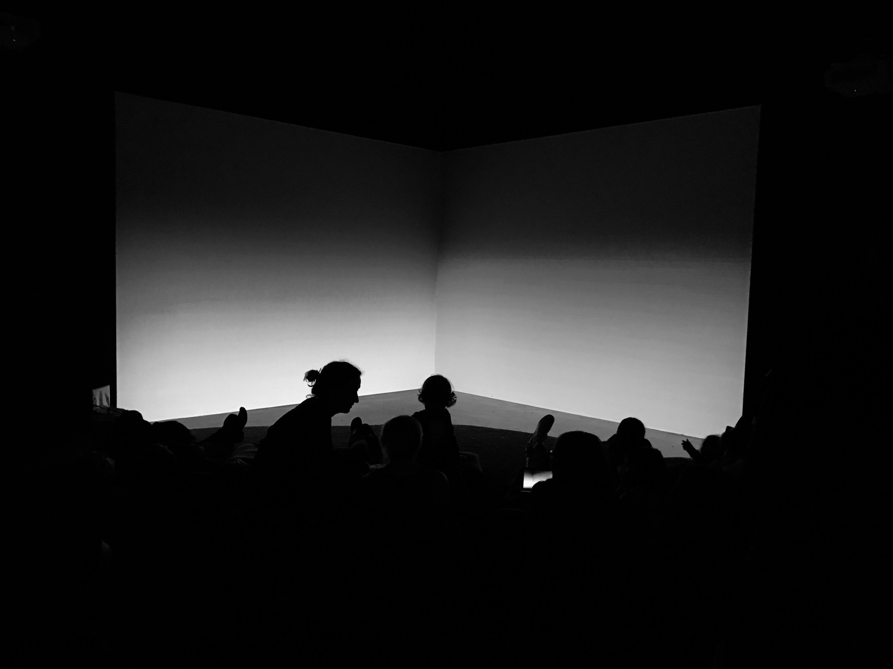

Not everything is good, obviously. But still, some things are. Inside the bubble, we've got a lot of good things. Like art museums, libraries, and even the zoo. The zoo is a good thing for us, maybe not the tenants.

Outside the bubble, yikes. We should focus on fixing that.  Meanwhile, let's focus on what's good.

I spent most of my morning commute trying to read Kevin Kelly's book [The Inevitable](https://www.amazon.com/Inevitable-Understanding-Technological-Forces-Future/dp/0525428089). This is good. All is not lost. We just need to figure out how to remix it. So far, my favorite part is the bit about publishing. We should probably figure that out too.

See a typo? [Please submit a pull-request](https://github.com/micahwalter/blogs-005-some-things-are-good)!